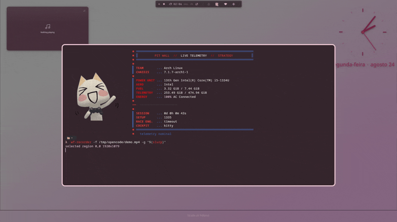

# focusZ — Z-Axis Depth Focus Layout for Hyprland

[](https://github.com/Lowingx/hypr-focuZ/actions/workflows/build.yml)



A Hyprland plugin that gives windows real **Z-axis depth**: the focused window sits
on top at full size, and background windows are **stacked behind it as overlapping
cards** that recede with reduced scale, opacity, and a depth-varying shadow.

**Works on any Hyprland 0.56.2 setup** — not tied to any specific distro or config.

## Effect

When `stacking` is enabled the stack becomes a pile of floating cards on the
monitor's active workspace. The focused card is resized to 72% of the workarea
(minus a margin) and centered; every deeper card is **smaller** — the box is
scaled by the layer's scale factor, so the scale is real geometry, not just a
render transform — and is **scattered at a random angle/radius** around the
focused card, pushed 24–80 px past its footprint (hashed from the window's
address so positions never jitter when you alt-tab). The pile reads as receding
scale, translucency, and blur. All workspace windows join the deck; those beyond
`max_layers` floor at 0.22 scale / 0.05 opacity as dim ghosts, so nothing ever
snaps back to 100% behind the deck.

| Layer | Scale | Opacity | Shadow |
|-------|-------|---------|--------|
| 0 (focused) | 1.00 | 1.0 | — (native) |
| 1 (behind)  | 0.70 | 0.85 | Medium |
| 2 (behind)  | 0.50 | 0.70 | Min |
| 3+          | extrapolated (−0.13/layer) | extrapolated (−0.18/layer) | Min |

Blur is **free**: with global `decoration:blur:enabled` on (default), the
translucent background cards blur whatever is behind them — wallpaper, layers,
and each other. The plugin API has no per-window blur radius (only an on/off
`noblur` window rule), so blur follows the global `blur:size`. For best results,
set a strong blur in your config (size 30, passes 8, noise 0.0).

Switching focus (clicking a card) promotes the window to Layer 0, re-stacks the
pile, and the cards animate to their new positions.

## Requirements

- **Hyprland 0.56.2** (exact version — the plugin is ABI-locked to the running build)
- `hyprland` headers (`hyprland` package on Arch, provides `pkg-config --cflags hyprland`)
- C++23 compiler (`g++` 14+ or `clang++` 18+)
- Build deps: `pixman`, `libdrm`

## Install

### Option 1: Build from source (any Hyprland)

```bash
git clone https://github.com/Lowingx/hypr-focuZ.git
cd hypr-focuZ
make
make install    # copies to ~/.local/share/hyprland/plugins/
```

Then add to your `~/.config/hypr/hyprland.conf`:

```hyprlang
plugin = ~/.local/share/hyprland/plugins/libfocusZ.so
```

### Option 2: Ryoku (if using Ryoku distro)

Ryoku loads plugins via modules. Add to your config:

```hyprlang
plugin = ~/.config/hypr/modules/focusz.so
```

Or use the Ryoku module system (`~/.config/hypr/modules/focusz.lua`).

> **Note:** The module loads `focusZ.so`, while `make install` produces
> `libfocusZ.so`. Keep the filename in sync after installing.

## Configuration

All options live under `plugin:focusZ:` in your Hyprland config:

```hyprlang
plugin {
    focusZ {
        # Master toggle
        enabled = true

        # Stack windows as overlapping floating cards (true), or keep tiling
        # and apply only scale/opacity (false)
        stacking = true

        # Number of distinct depth levels (1-16); all workspace windows join the
        # deck, deeper ones floor at 0.22 scale / 0.05 opacity
        max_layers = 8

        # Scale factors per background layer
        layer_1_scale = 0.70      # 0.1 - 1.0
        layer_2_scale = 0.50      # 0.1 - 1.0

        # Opacity per background layer
        layer_1_opacity = 0.85    # 0.0 - 1.0
        layer_2_opacity = 0.70    # 0.0 - 1.0

        # Animation speed for depth transitions (higher = snappier)
        animation_speed = 8.0     # 0.0 - 50.0

        # Front card size as a fraction of the workarea (0.3 - 1.0)
        card_front_scale = 0.72

        # Card scatter: tucked at workarea corners (true) or fanned around
        # the front card (false)
        card_edge_scatter = true

        # Re-deal back-card spawns every time the deck (re)builds
        card_scatter_reshuffle = true

        # Back-card peek distance from the workarea edge (edge mode) / how far a
        # card protrudes past the front footprint (around mode)
        card_peek_min = 24      # px (0 - 200)
        card_peek_max = 80      # px (0 - 400)

        # Scale windows toward monitor center (true) or top-left (false)
        center_scale = true

        # Write a debug log + heartbeat to ~/.local/share/hyprland/focusz-debug.log
        debug = false
    }
}
```

### Reserved config (registered but inert)

These keys are registered in the plugin and can be set in config, but they
currently have **no visual effect**. They are reserved for future features:

```hyprlang
plugin {
    focusZ {
        # Wallpaper canvas (M4.1 — render-path-safe revival needed)
        wallpaper_dim = 0.5         # 0.0 - 1.0
        wallpaper_zoom = 0.88       # 0.1 - 1.0
        canvas_zoom_floor = 0.55    # 0.1 - 1.0
        canvas_dim_floor = 0.15     # 0.0 - 1.0
        canvas_plate_alpha = 0.15   # 0.0 - 1.0
        canvas_plate_alpha_max = 0.30  # 0.0 - 1.0
        canvas_shadow_boost = 1.5   # 0.0 - 5.0
        canvas_plate = true
        canvas_plate_frost = 0.55   # 0.0 - 1.0

        # Card borders (M4.4 — render-path-safe revival needed)
        card_border = true
        card_border_width = 2       # px (0 - 10)
        card_border_color = 0x80ffffff  # 0xAARRGGBB

        # Card frost (M4.2 — render-path-safe revival needed)
        card_frost = false
        card_frost_strength = 0.4   # 0.0 - 1.0

        # Per-layer blur (API limitation — reserved, inert)
        layer_1_blur = true
        layer_2_blur = true
    }
}
```

Config changes need a `hyprctl reload` (or session restart) to take effect.

### Keybind

There is no default keybind. The `focusZ:cycle` dispatcher cycles focus through
the depth stack — bind it to whatever you like:

```hyprlang
bind = ALT, Tab, focusZ:cycle
```

> **Note:** If using Ryoku, do not bind `ALT+Tab` or `SUPER+Tab` to focusZ —
> those belong to Ryoku's overview system (`ryoku:overview`).

## How It Works

The plugin hooks into four Hyprland systems:

1. **EventBus listeners** — `window.active`, `window.open`, `window.close` and
   `window.destroy` events maintain an ordered Z-stack of windows. On focus change
   the newly focused window is promoted to Layer 0 and the rest demote. The stack
   is anchored to the focused monitor's **active workspace**, so windows on other
   monitors or other workspaces are never touched.

2. **Per-window opacity** — Each background window gets reduced alpha based on
   its depth layer. This is a pure render property — safe on tiled and floating
   windows alike. The focused window stays at full opacity.

3. **Stacking as floating cards** — When `stacking` is on, stack windows are
   floated (`changeFloatingMode`) and positioned with `setPositionGlobal`, which
   for a floating window applies the box directly — the tiling algorithm can't
   re-arrange it back (the geometry oscillation that froze earlier builds). The
   renderer draws floating windows in window-list order, and focus via `cyclenext`
   does **not** raise a floating window, so the plugin explicitly raises the stack
   deepest→focused on every mutation to keep the focused card on top. Only windows
   the plugin floated are returned to tiling on restore; user-floated windows are
   left alone. Fullscreen windows are skipped.

4. **Depth shadow decoration** — Every deck card receives a
   `CDepthShadowDecoration` (`IHyprWindowDecoration` subclass) whose shadow
   range/offset/alpha form a monotonic drop ladder. Both are removed when the
   window leaves the stack.

Depth lookups in the render path are O(1) (cached per window), and windows whose
depth didn't change are never re-damaged, so the per-frame cost is flat.

## Architecture

```
src/main.cpp            Plugin entry: PLUGIN_API_VERSION / PLUGIN_INIT / PLUGIN_EXIT
                    Registers config values, EventBus listeners, dispatcher
                    Version-hash check against running Hyprland

src/DepthFocus.hpp/cpp  CDepthFocusManager — the core depth engine
                    Maintains Z-stack, computes per-layer transforms,
                    floats + positions the stack

src/DepthShadow.hpp/cpp CDepthShadowDecoration — IHyprWindowDecoration subclass
                    Draws depth-aware shadows (range/offset vary by layer)
                    (DISABLED: no-op draw, not attached)

src/DebugLog.cpp/hpp    Optional debug logger + main-thread heartbeat
                    ~/.local/share/hyprland/focusz-debug.log

src/globals.hpp         Plugin handle + config value smart pointers
```

## Troubleshooting

**A new build doesn't take effect** — The plugin `.so` stays resident in the
running Hyprland; `hyprctl plugin unload`/`load` can hand back a stale handle.
Restart the Hyprland session after `make install` to pick up a fresh build.

**No visual effect** — Check `hyprctl getoption plugin:focusZ:enabled` and
`hyprctl getoption plugin:focusZ:stacking`, and make sure you have ≥2 windows on
the workspace. With `debug = true`, `focusz-debug.log` shows the stack rebuilds
and per-window depth applications.

**Windows went floating** — That's the stacking layout: cards overlap, so the
stack is floated and repositioned by the plugin. Set `stacking = false` to keep
tiling (opacity still applies), or `enabled = false` and `hyprctl reload` to
return every window to its tiled slot.

**Blur not changing** — Expected. Blur size is global (`blur:size`); the plugin
cannot scale blur radius per window. The cards only show blur behind them if
`decoration:blur:enabled` is on.

**Multi-monitor** — The depth stack is anchored to the focused monitor's active
workspace. Windows on other monitors or workspaces are left untouched; the stack
re-anchors when focus crosses monitors.

## Future Features

The following features are planned but not yet implemented. They require
re-introducing render-path code safely (the v0.56.2 crashes came from
`addPassElement` inside `RENDER_POST_WINDOWS`). Track progress on the
[kanban board](https://github.com/users/Lowingx/projects/3).

### Visual parity (M4)

Match the visual target (140 PNGs showing the desired depth/blur/canvas look):

- **Card borders** — rim around every deck card, clipped against the front
  card so back-card rims never cross the focused window. Config: `card_border`,
  `card_border_width`, `card_border_color`.
- **Wallpaper canvas** — dimmed/zoomed background layer behind the deck that
  recedes progressively as the stack fills. Config: `wallpaper_dim`,
  `wallpaper_zoom`, `canvas_zoom_floor`, `canvas_dim_floor`.
- **Frosted glass** — translucent veil over back cards, denser with depth,
  creating a Z-axis frost effect. Config: `card_frost`, `card_frost_strength`.
- **Canvas plate** — frosted matte surface under the cards. Config:
  `canvas_plate`, `canvas_plate_alpha`, `canvas_plate_frost`.
- **Depth tuning** — steeper scale/opacity falloff curve tuned to the target
  PNGs (currently approximate).
- **Dim on startup** — deck renders immediately without click-to-focus.
- **Layer exclusions** — per-class rules to never depth certain windows
  (docks, floats, special surfaces).

### Config & UX (M5)

- Animation easing/bezier per depth transition
- Shadow intensity/color config per layer
- Multi-monitor participation policy
- Configurable depth→transform curves (scale/opacity as f(layer))

### Ryoku integration (M6)

- `ryoku-focusZ` PKGBUILD for the Ryoku package manager
- Module sync: `focusz.lua` tracks plugin version
- ABI rebuild flow: detect `hyprland` package upgrade, auto-trigger rebuild
- Default config values baked into `hyprland.lua`
